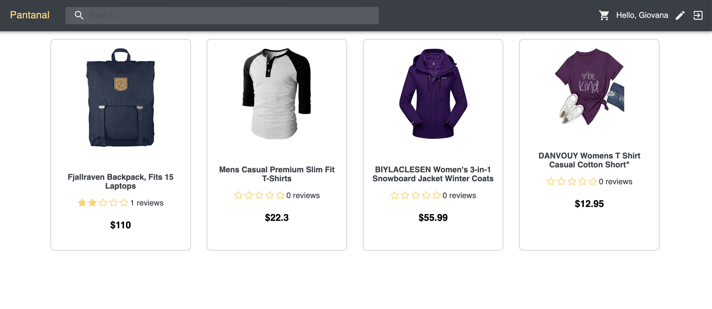
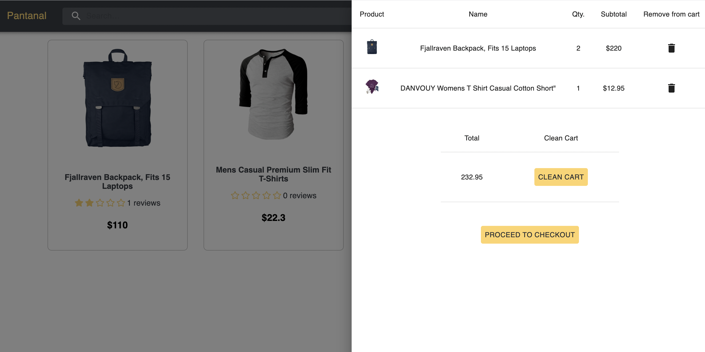
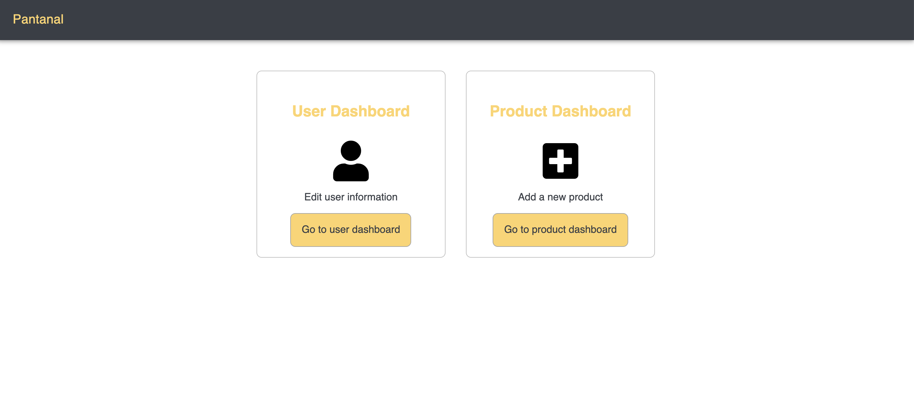

# Pantanal ecommerce website:

Homepage view:


Product details view:


Cart view:


Admin dashboard view:


### Built With

- [Node.js](https://nodejs.org/en/)
- [Express](https://expressjs.com/)
- [TypeScript](https://www.typescriptlang.org/)
- [bcrypt](https://www.npmjs.com/package/bcrypt)
- [jsonwebtoken](https://www.npmjs.com/package/jsonwebtoken)
- [supertest](https://www.npmjs.com/package/supertest)

<!-- GETTING STARTED -->

## Getting Started

### Prerequisites

This is an example of how to list things you need to use the software and how to install them.

- npm
  ```sh
  npm install npm@latest -g
  ```

### Installation

1. Clone the repo
   ```sh
   git clone https://github.com/gnyokota/backend-ecommerce.git
   ```
2. Install NPM packages
   ```sh
   npm install
   ```
3. `npm run build`
   compiles the app into .js files for production to the `dist` folder.
4. `npm run watch`
   runs the app from `src` folder in the development mode.
   Run [http://localhost:PORT](http://localhost:PORT) for http requests.
   PS: The port should be defined in the .env or app.ts files.
5. `npm run test`
   launches the all test from the `test` folder.
